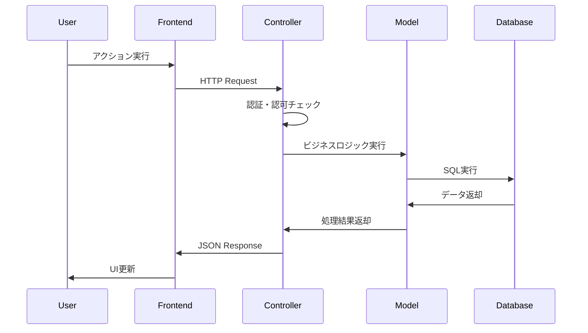
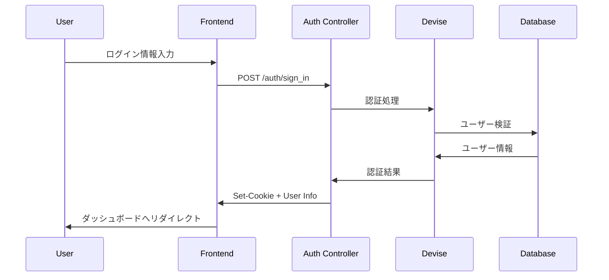

# アーキテクチャ設計書

## システム概要

### アーキテクチャパターン
**モノリシック 3層レイヤードアーキテクチャ**

### システム全体構成

```
┌─────────────────────────────────────────┐
│             Frontend (SPA)             │
│          React + TypeScript             │
│              Port: 3000                 │
└─────────────────┬───────────────────────┘
                  │ HTTP/JSON API
                  │ CORS + Cookies
                  ▼
┌─────────────────────────────────────────┐
│             Backend (API)               │
│            Rails 7.1 API                │
│              Port: 3001                 │
└─────────────────┬───────────────────────┘
                  │ ActiveRecord ORM
                  │ Connection Pool
                  ▼
┌─────────────────────────────────────────┐
│            Database                     │
│           PostgreSQL 15                 │
│              Port: 5432                 │
└─────────────────────────────────────────┘
```

## レイヤー設計

### 1. Presentation Layer（React Frontend）

```typescript
src/
├── components/           # 再利用可能コンポーネント
│   ├── common/          # 汎用コンポーネント
│   ├── auth/            # 認証関連
│   ├── training/        # トレーニング関連
│   ├── ranking/         # ランキング関連
│   └── admin/           # 管理画面関連
├── pages/               # ページコンポーネント
├── hooks/               # カスタムフック（ビジネスロジック）
├── services/            # API通信層
├── contexts/            # 状態管理（認証など）
├── types/               # TypeScript型定義
└── utils/               # ユーティリティ関数
```

**責務:**
- ユーザーインターフェース表示
- ユーザー操作の処理
- 状態管理（ローカル状態）
- APIとの通信制御

### 2. Application Layer（Rails Controllers）

```ruby
app/controllers/
├── api/
│   └── v1/
│       ├── base_controller.rb        # 共通処理
│       ├── auth/                     # 認証関連
│       │   ├── sessions_controller.rb
│       │   └── registrations_controller.rb
│       ├── trainings_controller.rb   # 一般ユーザー用
│       ├── training_records_controller.rb
│       ├── user_stat_controller.rb
│       ├── calendar_days_controller.rb
│       ├── point_rankings_controller.rb
│       ├── streak_rankings_controller.rb
│       └── admin/                    # 管理者用
│           └── trainings_controller.rb
```

**責務:**
- HTTPリクエスト/レスポンス処理
- 認証・認可制御
- 入力バリデーション
- JSON シリアライゼーション
- エラーハンドリング

### 3. Business Layer（Rails Models）

```ruby
app/models/
├── user.rb              # ユーザー（認証・権限）
├── training.rb          # トレーニングマスタ
├── training_record.rb   # トレーニング記録
├── user_stat.rb         # ユーザー統計（キャッシュ）
└── concerns/            # 共通処理
    ├── soft_deletable.rb
    └── rankable.rb
```

**責務:**
- ビジネスロジック
- データ整合性維持
- バリデーション
- 関連データの管理
- 計算処理（ポイント、連続日数）

### 4. Data Layer（PostgreSQL）

```sql
Tables:
├── users                # ユーザーマスタ
├── trainings           # トレーニングマスタ
├── training_records    # トレーニング実行記録
└── user_stats          # ユーザー統計キャッシュ
```

**責務:**
- データ永続化
- トランザクション制御
- インデックスによる高速化
- データ整合性制約

## 通信フロー

### 標準的なCRUD操作フロー



### 認証フロー（Devise Session）



## スケーラビリティ設計

### 現在の想定負荷
- **同時ユーザー**: 50人
- **ピーク時**: 全員が同時アクセス
- **データ量**: 年間 50 × 365 × 3 = 約55,000レコード

### パフォーマンス対策

#### 1. データベース最適化
```sql
-- 主要インデックス
CREATE INDEX idx_training_records_user_completed ON training_records(user_id, completed_at);
CREATE INDEX idx_training_records_completed_at ON training_records(completed_at);
CREATE INDEX idx_user_stats_total_points ON user_stats(total_points DESC);
CREATE INDEX idx_user_stats_current_streak ON user_stats(current_streak DESC);
```

#### 2. N+1クエリ対策
```ruby
# 悪い例
@records = current_user.training_records
@records.each { |record| puts record.training.name }

# 良い例
@records = current_user.training_records.includes(:training)
@records.each { |record| puts record.training.name }
```

#### 3. キャッシュ戦略
- **統計データ**: UserStatテーブルでキャッシュ
- **ランキング**: 計算結果をメモリキャッシュ（将来的にRedis）
- **静的データ**: Trainingsマスタは変更頻度が低い

## セキュリティアーキテクチャ

### 認証・認可フロー

```
┌─────────────────┐    ┌─────────────────┐    ┌─────────────────┐
│   Frontend      │    │   Rails API     │    │   Database      │
│                 │    │                 │    │                 │
│ ┌─────────────┐ │    │ ┌─────────────┐ │    │ ┌─────────────┐ │
│ │    Auth     │ │◄──►│ │   Devise    │ │◄──►│ │    Users    │ │
│ │   Context   │ │    │ │   Session   │ │    │ │   Table     │ │
│ └─────────────┘ │    │ └─────────────┘ │    │ └─────────────┘ │
│                 │    │                 │    │                 │
│ ┌─────────────┐ │    │ ┌─────────────┐ │    │                 │
│ │ Protected   │ │    │ │    RBAC     │ │    │                 │
│ │   Routes    │ │    │ │ (Role Check)│ │    │                 │
│ └─────────────┘ │    │ └─────────────┘ │    │                 │
└─────────────────┘    └─────────────────┘    └─────────────────┘
```

### セキュリティレイヤー
1. **Transport Layer**: HTTPS（本番環境）
2. **Session Layer**: Secure Cookies + CSRF Token
3. **Authentication**: Devise Session Based
4. **Authorization**: Role-based (user/admin)
5. **Input Validation**: Strong Parameters + Model Validation

## 開発・運用アーキテクチャ

### 開発環境
```
┌─────────────────────────────────────────┐
│          DevContainer                   │
│  ┌─────────────┐  ┌─────────────────┐   │
│  │   Rails     │  │     React       │   │
│  │ Development │  │  Development    │   │
│  │   Server    │  │     Server      │   │
│  │  Port:3001  │  │   Port:3000     │   │
│  └─────────────┘  └─────────────────┘   │
│           │               │             │
│           └───────┬───────┘             │
│                   │                     │
│          ┌─────────────────┐             │
│          │   PostgreSQL    │             │
│          │    Container    │             │
│          │   Port:5432     │             │
│          └─────────────────┘             │
└─────────────────────────────────────────┘
```

### 将来のスケールアウト戦略（参考）

#### Phase 1（現在）: モノリシック
- 1週間MVP
- 開発効率重視

#### Phase 2（成長期）: 分離
- フロントエンド: CDN化
- バックエンド: ロードバランサー
- データベース: レプリケーション

#### Phase 3（大規模）: マイクロサービス化
- 認証サービス分離
- ランキングサービス分離
- 通知サービス追加

## 設計原則

### 1. SOLID原則の適用
- **S**: Single Responsibility - 各クラスは単一の責任
- **O**: Open/Closed - 拡張に開いて変更に閉じる
- **L**: Liskov Substitution - サブクラスは基底クラスと置換可能
- **I**: Interface Segregation - クライアントが不要な依存を持たない
- **D**: Dependency Inversion - 抽象に依存する

### 2. Rails規約の活用
- **Convention over Configuration**
- **DHH流RESTful設計**
- **Fat Model, Skinny Controller**

### 3. 1週間制約への対応
- **YAGNI（You Aren't Gonna Need It）**: 不要な機能は実装しない
- **MVP First**: 最小価値機能に集中
- **技術的負債の管理**: 将来的なリファクタリング箇所の明記

この設計により、1週間でMVPを確実に完成させ、将来的な機能拡張にも対応可能な堅牢なアーキテクチャを実現します。