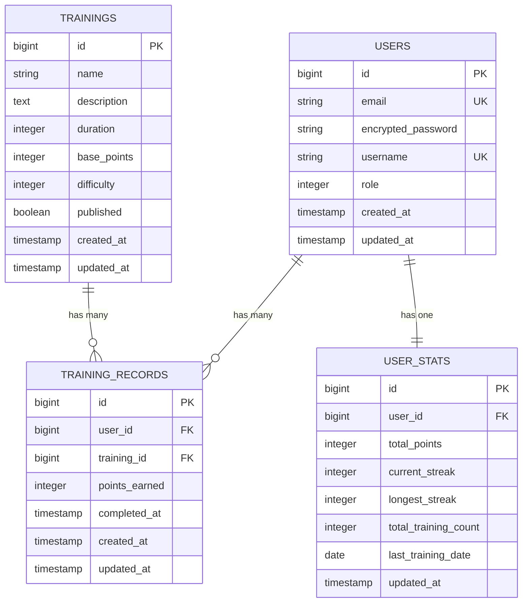

# データ設計書

## データベース概要

### DBMS選択理由
**PostgreSQL 15**
- ACID特性による強い整合性
- Rails ActiveRecordとの高い親和性
- JSON型サポート（将来の拡張性）
- 豊富なインデックス種別

### 設計原則
- 第3正規形までの正規化
- 統計テーブルは意図的な非正規化（パフォーマンス）
- 外部キー制約による整合性保証
- インデックス最適化によるクエリ高速化

## ER図



## テーブル設計

### 1. usersテーブル（Devise標準 + 拡張）

```sql
CREATE TABLE users (
    id                     BIGSERIAL PRIMARY KEY,
    email                  VARCHAR(255) NOT NULL DEFAULT '',
    encrypted_password     VARCHAR(255) NOT NULL DEFAULT '',
    reset_password_token   VARCHAR(255),
    reset_password_sent_at TIMESTAMP,
    remember_created_at    TIMESTAMP,
    username               VARCHAR(255) NOT NULL,
    role                   INTEGER NOT NULL DEFAULT 0,
    created_at             TIMESTAMP NOT NULL,
    updated_at             TIMESTAMP NOT NULL
);

-- インデックス
CREATE UNIQUE INDEX index_users_on_email ON users(email);
CREATE UNIQUE INDEX index_users_on_username ON users(username);
CREATE UNIQUE INDEX index_users_on_reset_password_token ON users(reset_password_token);

-- 制約
ALTER TABLE users ADD CONSTRAINT check_role
    CHECK (role IN (0, 1));  -- 0: user, 1: admin
```

**カラム詳細:**
- `email`: 認証用メールアドレス（一意）
- `username`: 表示用ユーザー名（一意）
- `role`: 権限レベル（0: 一般ユーザー, 1: 管理者）

### 2. trainingsテーブル（トレーニングマスタ）

```sql
CREATE TABLE trainings (
    id           BIGSERIAL PRIMARY KEY,
    name         VARCHAR(255) NOT NULL,
    description  TEXT NOT NULL,
    duration     INTEGER NOT NULL,
    base_points  INTEGER NOT NULL,
    difficulty   INTEGER NOT NULL DEFAULT 0,
    published    BOOLEAN NOT NULL DEFAULT true,
    created_at   TIMESTAMP NOT NULL,
    updated_at   TIMESTAMP NOT NULL
);

-- インデックス
CREATE INDEX index_trainings_on_published ON trainings(published);
CREATE INDEX index_trainings_on_difficulty ON trainings(difficulty);

-- 制約
ALTER TABLE trainings ADD CONSTRAINT check_duration
    CHECK (duration > 0);
ALTER TABLE trainings ADD CONSTRAINT check_base_points
    CHECK (base_points > 0);
ALTER TABLE trainings ADD CONSTRAINT check_difficulty
    CHECK (difficulty IN (0, 1, 2));  -- 0: beginner, 1: intermediate, 2: advanced
```

**カラム詳細:**
- `duration`: 実施時間（秒）
- `base_points`: 完了時の基本獲得ポイント
- `difficulty`: 難易度（0: 初級, 1: 中級, 2: 上級）
- `published`: 公開フラグ（非公開トレーニングは一般ユーザーに表示されない）

### 3. training_recordsテーブル（実行記録）

```sql
CREATE TABLE training_records (
    id            BIGSERIAL PRIMARY KEY,
    user_id       BIGINT NOT NULL,
    training_id   BIGINT NOT NULL,
    points_earned INTEGER NOT NULL,
    completed_at  TIMESTAMP NOT NULL,
    created_at    TIMESTAMP NOT NULL,
    updated_at    TIMESTAMP NOT NULL,

    CONSTRAINT fk_training_records_user
        FOREIGN KEY (user_id) REFERENCES users(id) ON DELETE CASCADE,
    CONSTRAINT fk_training_records_training
        FOREIGN KEY (training_id) REFERENCES trainings(id) ON DELETE RESTRICT
);

-- インデックス
CREATE INDEX index_training_records_on_user_id ON training_records(user_id);
CREATE INDEX index_training_records_on_training_id ON training_records(training_id);
CREATE INDEX index_training_records_on_completed_at ON training_records(completed_at);
-- 複合インデックス（ユーザーの時系列検索用）
CREATE INDEX index_training_records_user_completed ON training_records(user_id, completed_at);
-- ランキング計算用
CREATE INDEX index_training_records_completed_points ON training_records(completed_at, points_earned);

-- 制約
ALTER TABLE training_records ADD CONSTRAINT check_points_earned
    CHECK (points_earned > 0);
```

**カラム詳細:**
- `points_earned`: 実際に獲得したポイント（基本はbase_pointsと同じ）
- `completed_at`: トレーニング完了日時

### 4. user_statsテーブル（統計キャッシュ）

```sql
CREATE TABLE user_stats (
    id                    BIGSERIAL PRIMARY KEY,
    user_id              BIGINT NOT NULL,
    total_points         INTEGER NOT NULL DEFAULT 0,
    current_streak       INTEGER NOT NULL DEFAULT 0,
    longest_streak       INTEGER NOT NULL DEFAULT 0,
    total_training_count INTEGER NOT NULL DEFAULT 0,
    last_training_date   DATE,
    updated_at           TIMESTAMP NOT NULL,

    CONSTRAINT fk_user_stats_user
        FOREIGN KEY (user_id) REFERENCES users(id) ON DELETE CASCADE
);

-- インデックス
CREATE UNIQUE INDEX index_user_stats_on_user_id ON user_stats(user_id);
-- ランキング用インデックス（降順）
CREATE INDEX index_user_stats_on_total_points ON user_stats(total_points DESC);
CREATE INDEX index_user_stats_on_current_streak ON user_stats(current_streak DESC);

-- 制約
ALTER TABLE user_stats ADD CONSTRAINT check_total_points
    CHECK (total_points >= 0);
ALTER TABLE user_stats ADD CONSTRAINT check_current_streak
    CHECK (current_streak >= 0);
ALTER TABLE user_stats ADD CONSTRAINT check_longest_streak
    CHECK (longest_streak >= 0);
ALTER TABLE user_stats ADD CONSTRAINT check_total_training_count
    CHECK (total_training_count >= 0);
```

**カラム詳細:**
- `total_points`: 累計獲得ポイント
- `current_streak`: 現在の連続トレーニング日数（営業日ベース）
- `longest_streak`: 過去最長の連続日数（営業日ベース）
- `total_training_count`: 総トレーニング実行回数
- `last_training_date`: 最後にトレーニングした日付

### 連続日数計算ロジック（営業日考慮）

**holidays gemを使用した営業日ベースの連続日数計算:**
```ruby
# UserStatモデル内
def calculate_current_streak(last_date, new_date)
  return 1 if last_date.nil?

  # 営業日のみでの日数差を計算
  business_days_diff = business_days_between(last_date, new_date)

  case business_days_diff
  when 0
    current_streak # 同日は変更なし
  when 1
    current_streak + 1 # 連続営業日
  else
    1 # リセット（営業日ベースで1日以上空いた）
  end
end

private

def business_days_between(start_date, end_date)
  (start_date...end_date).count do |date|
    date.on_weekday? && !Holidays.on(date, :jp).any?
  end
end
```

**重要な仕様:**
- 土日祝日はトレーニングをしなくても連続日数が途切れない
- 営業日ベースで計算するため、金曜日→月曜日の実行は連続とみなされる
- 祝日も考慮し、日本の祝日カレンダーを使用

**必要なGem:**
```ruby
# Gemfile
gem 'holidays', '~> 8.0'
```

## データ整合性戦略

### 1. 外部キー制約

```sql
-- training_records → users (CASCADE削除)
-- ユーザー削除時は関連する記録も削除

-- training_records → trainings (RESTRICT削除)
-- トレーニングマスタに記録がある場合は削除不可

-- user_stats → users (CASCADE削除)
-- ユーザー削除時は統計も削除
```

### 2. トランザクション管理

**トレーニング記録作成時の処理:**
```ruby
ActiveRecord::Base.transaction do
  # 1. 記録作成
  record = TrainingRecord.create!(
    user: user,
    training: training,
    points_earned: training.base_points,
    completed_at: Time.current
  )

  # 2. 統計更新（同一トランザクション内）
  user.user_stat.recalculate_and_save!
end
```

### 3. 楽観的ロック（将来的）

```sql
-- user_statsテーブルにlock_versionカラム追加（将来的）
ALTER TABLE user_stats ADD COLUMN lock_version INTEGER DEFAULT 0;
```

## パフォーマンス設計

### 1. インデックス戦略

#### 検索パターン分析
- **ユーザーの記録一覧**: `user_id + completed_at DESC`
- **期間別ランキング**: `completed_at + points_earned DESC`
- **統計ランキング**: `total_points DESC`, `current_streak DESC`

#### 複合インデックス設計
```sql
-- 最も頻繁なクエリ用
CREATE INDEX idx_training_records_user_time ON training_records(user_id, completed_at DESC);

-- 週次・月次ランキング計算用
CREATE INDEX idx_training_records_time_points ON training_records(completed_at, points_earned DESC);

-- カレンダー表示用（日付グループ化）
CREATE INDEX idx_training_records_date ON training_records(date(completed_at));
```

### 2. クエリ最適化

#### N+1問題対策
```ruby
# 悪い例（N+1発生）
user.training_records.each { |record| puts record.training.name }

# 良い例（includes使用）
user.training_records.includes(:training).each { |record| puts record.training.name }
```

#### バッチクエリ使用
```ruby
# 月次カレンダーデータ取得
TrainingRecord.joins(:user)
              .where(completed_at: start_date..end_date)
              .group("DATE(completed_at)")
              .select("DATE(completed_at) as date,
                       SUM(points_earned) as total_points,
                       COUNT(*) as training_count")
```

### 3. キャッシュ戦略

#### 統計データキャッシュ
- **user_stats**: リアルタイム更新（非正規化）
- **ランキング**: 計算結果をメモリ保持（5分間）

#### 将来的なキャッシュ拡張
```ruby
# Redis導入時の設計
class RankingCache
  def self.get_point_ranking(period)
    Rails.cache.fetch("ranking:points:#{period}", expires_in: 5.minutes) do
      calculate_point_ranking(period)
    end
  end
end
```

## データマイグレーション戦略

### 1. 初期データ作成

```ruby
# db/seeds.rb
# 管理者ユーザー作成
admin = User.create!(
  email: 'admin@example.com',
  username: 'admin',
  password: 'password',
  role: :admin
)

# サンプルトレーニング作成
trainings = [
  { name: '腕立て伏せ', description: '胸筋と腕力を鍛える', duration: 60, base_points: 10, difficulty: :beginner },
  { name: 'スクワット', description: '下半身を強化する', duration: 90, base_points: 15, difficulty: :intermediate },
  { name: 'プランク', description: '体幹を鍛える', duration: 30, base_points: 8, difficulty: :beginner }
]

trainings.each { |attrs| Training.create!(attrs) }
```

### 2. マイグレーション履歴管理

```ruby
# マイグレーションファイルの命名規則
# 001_devise_create_users.rb
# 002_create_trainings.rb
# 003_create_training_records.rb
# 004_create_user_stats.rb
# 005_add_indexes_to_training_records.rb
```

## データ監視・メンテナンス

### 1. 定期メンテナンス

```sql
-- 月次実行推奨
-- インデックス再構築
REINDEX TABLE training_records;

-- 統計情報更新
ANALYZE training_records;
ANALYZE user_stats;
```

### 2. データサイズ見積もり

**年間データ量見積もり:**
```
ユーザー数: 50人
1日平均トレーニング: 2回/人
年間レコード数: 50 × 2 × 365 = 36,500件

training_records: 36,500件 × 200byte ≈ 7.3MB/年
user_stats: 50件 × 150byte ≈ 7.5KB
```

**5年間での総データ量: 約37MB（十分小規模）**

### 3. バックアップ戦略

```bash
# 日次バックアップ（推奨）
pg_dump -h localhost -U postgres training_app_production > backup_$(date +%Y%m%d).sql

# 差分バックアップ（PostgreSQL WAL-G使用）
wal-g backup-push /var/lib/postgresql/data
```

このデータ設計により、1週間での開発と将来的な拡張の両方に対応した堅牢なデータアーキテクチャを実現します。