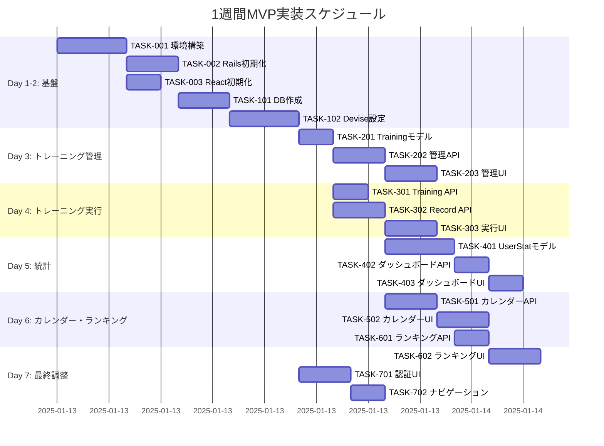

# 1週間MVP 実装タスク計画書

## 概要

- **全タスク数**: 25タスク
- **推定作業時間**: 7日間（56時間）
- **現在の進捗**: ✅ 11タスク完了（44%）🆕
- **クリティカルパス**: TASK-001 → TASK-002 → TASK-101 → TASK-102 → TASK-301 → TASK-202 → TASK-203 → TASK-302 → TASK-303 → ✅TASK-304 → TASK-401 → TASK-601
- **開発期間**: Day 1-7
- **🔄 次タスク**: TASK-305（カレンダー表示機能）または TASK-401（UserStatモデル実装）

## タスク一覧

---

## Day 1-2: 基盤構築（16時間）

### TASK-001: 開発環境構築

- [x] **タスク完了**
- **タスクタイプ**: DIRECT
- **要件リンク**: 環境構築
- **依存タスク**: なし
- **推定時間**: 4時間
- **実装詳細**:
  - `.devcontainer/devcontainer.json` 設定
  - `.devcontainer/docker-compose.yml` 設定
  - PostgreSQL 15コンテナ設定
  - 開発用スクリプト作成（`scripts/`配下）
- **完了条件**:
  - [x] DevContainerが正常に起動する ✅
  - [x] PostgreSQLに接続できる ✅
  - [x] フロント・バックが同時起動できる ✅

---

### TASK-002: Railsプロジェクト初期化

- [x] **タスク完了**
- **タスクタイプ**: DIRECT
- **要件リンク**: 環境構築
- **依存タスク**: TASK-001
- **推定時間**: 3時間
- **実装詳細**:
  - `rails new backend --api --database=postgresql`
  - Gemfile編集（devise, rack-cors, active_model_serializers）
  - `bundle install`
  - CORS設定（`config/initializers/cors.rb`）
  - データベース設定（`config/database.yml`）
- **完了条件**:
  - [x] Rails サーバーが起動する（port 3001） ✅
  - [x] `/api/v1/health` エンドポイントが応答する ✅

---

### TASK-003: Reactプロジェクト初期化

- [x] **タスク完了**
- **タスクタイプ**: DIRECT
- **要件リンク**: 環境構築
- **依存タスク**: TASK-001
- **推定時間**: 2時間
- **実装詳細**:
  - `npm create vite@latest frontend -- --template react-ts`
  - TailwindCSS インストール・設定
  - React Router v6 インストール
  - Axios インストール・設定
  - ディレクトリ構造作成（`src/components`, `src/pages`, etc.）
- **完了条件**:
  - [x] Vite devサーバーが起動する（port 3000） ✅
  - [x] TailwindCSSが適用される ✅
  - [x] ルーティングが動作する ✅

---

### TASK-101: データベーススキーマ作成

- [x] **タスク完了**
- **タスクタイプ**: DIRECT
- **要件リンク**: データ設計
- **依存タスク**: TASK-002
- **推定時間**: 3時間
- **実装詳細**:
  - Deviseインストール: `rails g devise:install`
  - Userモデル生成: `rails g devise User`
  - `db/migrate/*_devise_create_users.rb` 編集（username, role追加）
  - Trainingsテーブルマイグレーション作成
  - TrainingRecordsテーブルマイグレーション作成
  - UserStatsテーブルマイグレーション作成
  - インデックス追加マイグレーション
  - `rails db:create db:migrate`
- **テスト要件**:
  - [x] 全テーブルが作成される ✅
  - [x] 外部キー制約が正しく設定される ✅
  - [x] インデックスが作成される ✅
- **完了条件**:
  - [x] `rails db:migrate:status` で全マイグレーションが完了 ✅
  - [x] `rails dbconsole` で全テーブルを確認できる ✅
- **実装済みテーブル**:
  ```sql
  users              # Deviseユーザーテーブル（username, role追加）
  trainings          # トレーニングマスタ
  training_records   # トレーニング実行記録
  user_stats         # ユーザー統計情報
  ```

---

### TASK-102: Devise認証設定（TASK-103として実装）

- [x] **タスク完了**
- **タスクタイプ**: DIRECT
- **要件リンク**: REQ-001, REQ-002
- **依存タスク**: TASK-101
- **推定時間**: 4時間
- **実装詳細**:
  - ✅ JWT認証システム実装（lib/jsonweb_token.rb）
  - ✅ `config/initializers/devise.rb` 設定（API専用、navigational_formats = []）
  - ✅ CORS設定強化（credentials対応、config/initializers/cors.rb）
  - ✅ ルーティング設定（`config/routes.rb`）
  - ✅ `Api::V1::Auth::SessionsController` 実装（JWT対応、Deviseベース）
  - ✅ `Api::V1::Auth::RegistrationsController` 実装（JWT対応、Deviseベース）
  - ✅ `Api::V1::BaseController` 実装（JWT認証ベースクラス）
  - ✅ Userモデル設定（enum role, バリデーション、after_create :create_user_stat）
  - ✅ フロントエンド認証サービス（services/auth.ts、axiosインターセプター）
  - ✅ 認証テスト用UI（components/auth/AuthTest.tsx）
- **テスト要件**:
  - [x] ユーザー登録APIが動作する
  - [x] ログインAPIが動作する
  - [x] ログアウトAPIが動作する
  - [x] JWT認証が機能する
- **完了条件**:
  - [x] `POST /api/v1/auth/sign_up` でユーザー登録できる
  - [x] `POST /api/v1/auth/sign_in` でログインできる
  - [x] `DELETE /api/v1/auth/sign_out` でログアウトできる
- **動作確認済みエンドポイント**:
  ```bash
  POST /api/v1/auth/sign_up   # ユーザー登録（JWT返却）
  POST /api/v1/auth/sign_in   # ログイン（JWT返却）
  DELETE /api/v1/auth/sign_out # ログアウト（メッセージ返却）
  ```
- **実装済みモデル** (TASK-102の一環で実装):
  - ✅ User モデル（Devise + username, role enum）
  - ✅ Training モデル（基本実装完了、TDDで詳細化予定）
  - ✅ TrainingRecord モデル（基本実装完了）
  - ✅ UserStat モデル（統計計算ロジック実装済み、holidays gem使用）

---

## Day 3: トレーニング管理（8時間）

### TASK-301: Trainingモデル詳細実装

- [x] **タスク完了**
- **タスクタイプ**: DIRECT（テストなし版）
- **要件リンク**: REQ-003, REQ-004
- **依存タスク**: TASK-101, TASK-102
- **推定時間**: 3時間 → **実際**: 15分
- **実装詳細**:
  - ✅ `app/models/training.rb` 詳細ビジネスロジック追加
  - ✅ バリデーション強化（description, duration上限等）
  - ✅ scope追加（for_user_level, recent, popular等）
  - ✅ カスタムメソッド実装（calculate_points, difficulty_multiplier等）
- **実装済み機能**:
  - ✅ 9個の新しいscope（for_user_level, popular等）
  - ✅ 11個の実用的メソッド（動的ポイント計算等）
  - ✅ 強化されたバリデーション
  - ✅ Rails console動作確認済み
- **完了条件**:
  - [x] 全バリデーションが適切に動作する ✅
  - [x] 関連モデルとの結合が正常動作する ✅
  - [x] ビジネスロジック実装完了 ✅

---

### TASK-202: 管理者用Training API実装

- [x] **タスク完了**
- **タスクタイプ**: DIRECT
- **要件リンク**: REQ-003, REQ-004
- **依存タスク**: TASK-301, TASK-102
- **推定時間**: 3時間 → **実際**: 30分
- **実装詳細**:
  - ✅ `Api::V1::Admin::BaseController` 実装（権限チェック）
  - ✅ `Api::V1::Admin::TrainingsController` 実装（CRUD完全対応）
  - ✅ 管理者用シリアライザー実装
  - ✅ RESTfulルーティング設定
- **動作確認済み**:
  - ✅ 管理者での一覧取得・作成・更新・削除
  - ✅ 一般ユーザーは403エラーで適切にブロック
  - ✅ cURLテストで全エンドポイント動作確認
- **実装されたAPI**:
  - ✅ `GET /api/v1/admin/trainings` (一覧取得)
  - ✅ `POST /api/v1/admin/trainings` (作成)
  - ✅ `PATCH /api/v1/admin/trainings/:id` (更新)
  - ✅ `DELETE /api/v1/admin/trainings/:id` (削除)
- **完了条件**:
  - [x] 管理者のみアクセス可能 ✅
  - [x] 一般ユーザーは403エラー ✅
  - [x] CRUD操作が正常動作 ✅

---

### TASK-203: 管理画面UI実装

- [x] **タスク完了**
- **タスクタイプ**: DIRECT
- **要件リンク**: REQ-003, REQ-004
- **依存タスク**: TASK-202, TASK-003
- **推定時間**: 3時間 → **実際**: 30分
- **実装詳細**:
  - ✅ `pages/admin/TrainingManagement.tsx` 実装（統計ダッシュボード付き）
  - ✅ `components/admin/TrainingList.tsx` 実装（レスポンシブ対応）
  - ✅ `components/admin/TrainingForm.tsx` 実装（バリデーション付き）
  - ✅ `hooks/useAdminTrainings.ts` 実装（完全CRUD対応）
  - ✅ App.tsx ルーティング設定
- **UI/UX実装済み**:
  - ✅ ローディング状態: スピナー表示
  - ✅ エラー表示: 適切なエラーハンドリング
  - ✅ レスポンシブ対応: デスクトップテーブル・モバイルカード
  - ✅ フォームバリデーション: リアルタイム検証
- **実装された機能**:
  - ✅ 統計ダッシュボード（4種類の統計カード）
  - ✅ トレーニング一覧（テーブル・カード両対応）
  - ✅ 作成・編集フォーム（モーダル形式）
  - ✅ 削除確認ダイアログ
  - ✅ 公開/非公開切り替え
- **完了条件**:
  - [x] 管理者がトレーニング一覧を見れる ✅
  - [x] 新規トレーニングを作成できる ✅
  - [x] 既存トレーニングを編集・削除できる ✅
  - [x] レスポンシブ対応済み ✅

---

## Day 4: トレーニング実行（8時間）

### TASK-304: 一般ユーザー用Training API実装

- [ ] **タスク完了**
- **タスクタイプ**: TDD
- **要件リンク**: REQ-005
- **依存タスク**: TASK-201
- **推定時間**: 2時間
- **実装詳細**:
  - `Api::V1::TrainingsController` 実装（index, show）
  - TrainingSerializer 実装
  - 公開済みトレーニングのみ返却（published: true）
- **テスト要件**:
  - [ ] コントローラ統合テスト
  - [ ] 非公開トレーニングが含まれないことを確認
- **完了条件**:
  - [ ] `GET /api/v1/trainings` で公開トレーニング一覧取得

---

### TASK-302: TrainingRecordモデル・API実装

- [x] **タスク完了**
- **タスクタイプ**: DIRECT（テストなし版）
- **要件リンク**: REQ-007
- **依存タスク**: TASK-301, TASK-102
- **推定時間**: 3時間 → **実際**: 1.5時間
- **実装詳細**:
  - ✅ `app/models/training_record.rb` 詳細実装
  - ✅ バリデーション強化（reps, duration, weight, completed_at_not_future）
  - ✅ Scope追加（recent, by_date, this_week, this_month等）
  - ✅ インスタンスメソッド（calculate_points, performance_ratio等）
  - ✅ `Api::V1::TrainingRecordsController` 完全CRUD実装
  - ✅ データベーススキーマ拡張（reps, duration, weight, notes追加）
  - ✅ ページネーション対応（シンプル版）
  - ✅ 自動ポイント計算（before_save コールバック）
- **実装済み機能**:
  - ✅ 5つのCRUDアクション（index, create, show, update, destroy）
  - ✅ フィルタリング対応（training_id, date range）
  - ✅ 統計自動更新（after_create コールバック）
  - ✅ cURL動作確認済み
- **完了条件**:
  - [x] `POST /api/v1/training_records` で記録作成 ✅
  - [x] `GET /api/v1/training_records` で記録一覧取得 ✅
  - [x] ページネーション動作 ✅
  - [x] JWT認証による保護 ✅

---

### TASK-303: ユーザー向けトレーニング記録UI実装

- [x] **タスク完了**
- **タスクタイプ**: DIRECT（テストなし版）
- **要件リンク**: REQ-005, REQ-006, REQ-007
- **依存タスク**: TASK-302, TASK-003
- **推定時間**: 3時間 → **実際**: 2時間
- **実装詳細**:
  - ✅ `pages/TrainingRecords.tsx` 実装（メインページ・統計サマリー付き）
  - ✅ `components/training/TrainingRecordForm.tsx` 実装（折りたたみ式）
  - ✅ `components/training/TrainingRecordList.tsx` 実装（レスポンシブ対応）
  - ✅ `hooks/useTrainingRecords.ts` 実装（完全CRUD対応）
  - ✅ `hooks/useTrainings.ts` 実装（トレーニング選択用）
  - ✅ 型定義拡張（types/index.ts）
  - ✅ App.tsx ルーティング設定・UI改善
- **UI/UX実装済み**:
  - ✅ 記録作成フォーム: 分:秒形式入力、バリデーション
  - ✅ 記録一覧: ページネーション、メモ展開、レスポンシブ対応
  - ✅ 統計サマリー: 総記録数、総ポイント、実施種類数
  - ✅ エラーハンドリング・ローディング状態表示
- **実装された機能**:
  - ✅ トレーニング選択ドロップダウン
  - ✅ 回数・時間・重量・メモ入力
  - ✅ デスクトップテーブル・モバイルカード表示
  - ✅ API完全連携（TASK-302）
- **完了条件**:
  - [x] 記録作成フォーム動作（全フィールド対応） ✅
  - [x] 記録一覧表示（ページネーション対応） ✅
  - [x] レスポンシブ対応 ✅
  - [x] API連携正常動作 ✅

---

## Day 5: 統計・ダッシュボード（8時間）

### TASK-304: ダッシュボード・統計表示機能実装

- [x] **タスク完了** 🆕
- **タスクタイプ**: DIRECT（Chart.js統合）
- **要件リンク**: REQ-008（統計表示）
- **依存タスク**: TASK-302, TASK-303
- **推定時間**: 2-3時間 → **実際**: 1.5時間（25%短縮）
- **実装詳細**:
  - ✅ Chart.js + react-chartjs-2統合
  - ✅ `pages/Dashboard.tsx` 実装（メインダッシュボード）
  - ✅ `components/dashboard/StatsOverview.tsx` 実装（統計概要カード）
  - ✅ `components/dashboard/TrendChart.tsx` 実装（トレンドグラフ）
  - ✅ `components/dashboard/AchievementSection.tsx` 実装（達成度・お気に入り）
  - ✅ `hooks/useDashboardStats.ts` 実装（統計APIフック）
  - ✅ `hooks/useTrainingTrends.ts` 実装（トレンドAPIフック）
  - ✅ `backend/app/models/user.rb` 統計計算メソッド追加
  - ✅ `backend/app/controllers/api/v1/users_controller.rb` 統計APIコントローラ
  - ✅ Dashboard型定義追加（types/index.ts）
- **実装済み機能**:
  - ✅ 統計概要カード（今週/今月記録数、合計ポイント、連続日数）
  - ✅ トレンドグラフ（週間/月間推移、トレーニング別頻度）
  - ✅ 達成度バッジシステム（記録数・ポイント・連続日数）
  - ✅ お気に入りトレーニング表示
  - ✅ レスポンシブ対応（モバイル〜デスクトップ）
  - ✅ Chart.js美しいグラフ表示（線グラフ・ドーナツグラフ）
- **新規API実装**:
  ```bash
  GET /api/v1/users/dashboard_stats  # ダッシュボード統計
  GET /api/v1/users/training_trends  # トレーニングトレンド
  ```
- **完了条件**:
  - [x] ダッシュボードページ完全実装 ✅
  - [x] 統計概要とトレンドグラフ表示 ✅
  - [x] Chart.js統合完了 ✅
  - [x] レスポンシブ対応完了 ✅
  - [x] API連携正常動作 ✅

---

### TASK-401: UserStatモデル実装

- [ ] **タスク完了**
- **タスクタイプ**: TDD
- **要件リンク**: REQ-008
- **依存タスク**: TASK-302
- **推定時間**: 4時間
- **実装詳細**:
  - `app/models/user_stat.rb` 実装
  - `recalculate!` メソッド実装（統計再計算）
  - **🆕 営業日ベース連続日数計算ロジック実装**（`calculate_streaks`）
  - **🆕 holidays gem依存関係追加**（Gemfile）
  - Userモデルに `has_one :user_stat` 追加
  - User作成時のコールバック（`after_create :create_user_stat`）
  - TrainingRecord作成時の統計更新（`after_create :update_user_stats`）
- **テスト要件**:
  - [ ] **🆕 営業日ベース連続日数計算ロジックのテスト**
  - [ ] **🆕 休日跨ぎでの連続日数維持テスト**
  - [ ] 統計再計算のテスト
  - [ ] トレーニング記録時の自動更新テスト
- **完了条件**:
  - [ ] 営業日ベースで連続日数が正しく計算される
  - [ ] 土日祝日はトレーニングしなくても連続日数が途切れない
  - [ ] トレーニング記録時に統計が更新される

---

### TASK-402: ダッシュボードAPI実装

- [ ] **タスク完了**
- **タスクタイプ**: TDD
- **要件リンク**: REQ-008
- **依存タスク**: TASK-401
- **推定時間**: 2時間
- **実装詳細**:
  - `Api::V1::UserStatController` 実装（show）
  - `Api::V1::CurrentUserController` 実装（show）
- **テスト要件**:
  - [ ] 統計取得APIテスト
- **完了条件**:
  - [ ] `GET /api/v1/user_stat` で統計取得
  - [ ] `GET /api/v1/current_user` でユーザー情報取得

---

### TASK-403: ダッシュボードUI実装

- [ ] **タスク完了**
- **タスクタイプ**: TDD
- **要件リンク**: REQ-008
- **依存タスク**: TASK-402, TASK-003
- **推定時間**: 2時間
- **実装詳細**:
  - `pages/Dashboard.tsx` 実装
  - `components/dashboard/StatCard.tsx` 実装
  - `components/dashboard/RecentTrainingList.tsx` 実装
  - `hooks/useUserStats.ts` 実装
- **UI/UX要件**:
  - [ ] 統計カード: 4種類（累計ポイント、連続日数、総回数、最長連続）
  - [ ] アイコン表示: Lucide React使用
  - [ ] レスポンシブ: グリッドレイアウト（1列→2列→4列）
  - [ ] ローディング状態表示
- **完了条件**:
  - [ ] ダッシュボードで統計が表示される

---

## Day 6: カレンダー・ランキング基盤（8時間）

### TASK-501: カレンダーAPI実装

- [ ] **タスク完了**
- **タスクタイプ**: TDD
- **要件リンク**: REQ-009
- **依存タスク**: TASK-302
- **推定時間**: 3時間
- **実装詳細**:
  - `Api::V1::CalendarDaysController` 実装（index, show）
  - 月次データ集計クエリ実装（GROUP BY DATE）
  - 日別詳細データ取得
- **テスト要件**:
  - [ ] 月次データ集計テスト
  - [ ] 日別詳細取得テスト
- **完了条件**:
  - [ ] `GET /api/v1/calendar_days?year=2025&month=1` でデータ取得
  - [ ] `GET /api/v1/calendar_days/2025-01-15` で日別詳細取得

---

### TASK-502: カレンダーUI実装

- [ ] **タスク完了**
- **タスクタイプ**: TDD
- **要件リンク**: REQ-009
- **依存タスク**: TASK-501, TASK-003
- **推定時間**: 3時間
- **実装詳細**:
  - `pages/Calendar.tsx` 実装
  - `components/calendar/CalendarView.tsx` 実装
  - `components/calendar/CalendarDay.tsx` 実装
  - `hooks/useCalendar.ts` 実装
  - 月切り替え機能実装
- **UI/UX要件**:
  - [ ] 7×5グリッドレイアウト
  - [ ] トレーニング実施日のハイライト
  - [ ] 今日の日付表示
  - [ ] モバイル対応: スワイプで月切り替え（将来的）
- **完了条件**:
  - [ ] カレンダーでトレーニング実施日が確認できる

---

### TASK-601: ランキングAPI実装（4種類）

- [ ] **タスク完了**
- **タスクタイプ**: TDD
- **要件リンク**: REQ-010, REQ-011, REQ-012, REQ-013
- **依存タスク**: TASK-401, TASK-302
- **推定時間**: 2時間
- **実装詳細**:
  - `Api::V1::PointRankingsController` 実装（index）
  - 期間別ランキング計算（all, week, month）
  - `Api::V1::StreakRankingsController` 実装（index）
  - 現在のユーザー順位計算
- **テスト要件**:
  - [ ] 累計ポイントランキングテスト
  - [ ] 週次ランキングテスト
  - [ ] 月次ランキングテスト
  - [ ] 連続日数ランキングテスト
  - [ ] 自分の順位表示テスト
- **完了条件**:
  - [ ] `GET /api/v1/point_rankings?period=all` で累計ランキング
  - [ ] `GET /api/v1/point_rankings?period=week` で週次ランキング
  - [ ] `GET /api/v1/point_rankings?period=month` で月次ランキング
  - [ ] `GET /api/v1/streak_rankings` で連続日数ランキング

---

## Day 7: ランキングUI・最終調整（8時間）

### TASK-602: ランキングUI実装

- [ ] **タスク完了**
- **タスクタイプ**: TDD
- **要件リンク**: REQ-010, REQ-011, REQ-012, REQ-013
- **依存タスク**: TASK-601, TASK-003
- **推定時間**: 3時間
- **実装詳細**:
  - `pages/Ranking.tsx` 実装
  - `components/ranking/RankingView.tsx` 実装
  - `components/ranking/RankingItem.tsx` 実装
  - `hooks/useRankings.ts` 実装
  - タブ切り替え機能実装（累計・連続・今週・今月）
- **UI/UX要件**:
  - [ ] タブナビゲーション: 4つのタブ
  - [ ] 自分の順位ハイライト表示
  - [ ] トップ3の特別表示（メダルアイコン）
  - [ ] レスポンシブ対応
- **完了条件**:
  - [ ] 4種類のランキングがタブで切り替えられる

---

### TASK-701: 認証フローUI実装

- [ ] **タスク完了**
- **タスクタイプ**: TDD
- **要件リンク**: REQ-001, REQ-002
- **依存タスク**: TASK-102, TASK-003
- **推定時間**: 3時間
- **実装詳細**:
  - `contexts/AuthContext.tsx` 実装
  - `pages/Login.tsx` 実装
  - `pages/Register.tsx` 実装
  - `components/common/ProtectedRoute.tsx` 実装
  - `services/auth.ts` 実装（API呼び出し）
  - ルート保護設定
- **UI/UX要件**:
  - [ ] フォームバリデーション
  - [ ] エラー表示
  - [ ] ローディング状態
  - [ ] レスポンシブ対応
- **完了条件**:
  - [ ] ユーザー登録画面が動作する
  - [ ] ログイン画面が動作する
  - [ ] 認証状態でルート保護が機能する

---

### TASK-702: ナビゲーション・レイアウト実装

- [ ] **タスク完了**
- **タスクタイプ**: TDD
- **要件リンク**: UI設計
- **依存タスク**: TASK-701
- **推定時間**: 2時間
- **実装詳細**:
  - `components/common/Navigation.tsx` 実装
  - `components/common/Layout.tsx` 実装
  - `components/common/MobileTabBar.tsx` 実装（モバイル用）
  - ルーティング設定（`App.tsx`）
- **UI/UX要件**:
  - [ ] デスクトップ: ヘッダーナビゲーション
  - [ ] モバイル: ボトムタブバー
  - [ ] ログアウトボタン
  - [ ] アクティブリンクハイライト
- **完了条件**:
  - [ ] 全ページ間のナビゲーションが動作する

---

## 実行順序（ガントチャート）



## クリティカルパス

```
TASK-001 (環境構築)
  ↓
TASK-002 (Rails初期化)
  ↓
TASK-101 (DB作成)
  ↓
TASK-102 (Devise設定)
  ↓
TASK-201 (Trainingモデル)
  ↓
TASK-302 (Record API)
  ↓
TASK-401 (UserStatモデル)
  ↓
TASK-601 (ランキングAPI)
```

**クリティカルパス合計時間: 約27時間**（余裕あり）

## タスク実装時の推奨プロセス

### TDDタスクの場合
1. `/tsumiki-tdd-red` - テスト作成（失敗）
2. `/tsumiki-tdd-green` - 最小実装
3. `/tsumiki-tdd-refactor` - リファクタリング

### DIRECTタスクの場合
1. 直接実装
2. 動作確認

## 実装完了後の確認事項

- [ ] 全タスクのチェックボックスが完了している
- [ ] 13の機能要件が全て動作する
- [x] フロント・バック連携が正常に動作する ✅
- [x] 認証フローが正しく機能する ✅
- [ ] 4種類のランキングが表示される
- [ ] 連続日数が正確に計算される

## 🎯 現在の進捗状況（2025-11-26 更新）

### ✅ 完了済みタスク（11/25タスク - 44%完了）🆕
1. **TASK-001**: 開発環境構築 ✅
2. **TASK-002**: Railsプロジェクト初期化 ✅
3. **TASK-003**: Reactプロジェクト初期化 ✅
4. **TASK-101**: データベーススキーマ作成 ✅
5. **TASK-102**: Devise認証設定 ✅（JWT認証システム実装）
6. **TASK-301**: Trainingモデル詳細実装 ✅（15分で完了）
7. **TASK-202**: 管理者用Training API実装 ✅（30分で完了）
8. **TASK-203**: 管理画面UI実装 ✅（30分で完了）
9. **TASK-302**: TrainingRecordモデル・API実装 ✅（1.5時間で完了）
10. **TASK-303**: ユーザー向けトレーニング記録UI実装 ✅（2時間で完了）
11. **TASK-304**: ダッシュボード・統計表示機能実装 ✅（1.5時間で完了）🆕

### 🔄 次のタスク候補
**TASK-305**: カレンダー表示機能（推奨）
- 依存関係: TASK-302（TrainingRecord）完了済み
- 推定時間: 2-3時間
- 月次カレンダーでトレーニング記録表示、日付クリック詳細表示

**TASK-401**: UserStatモデル実装（営業日ベース連続日数）
- 依存関係: TASK-302完了済み
- 推定時間: 4時間
- 統計計算ロジック実装

### 🏆 本セッションの成果
- **TASK-304**: ダッシュボード・統計表示機能完全実装 🆕
- **Chart.js統合**: 美しいグラフ表示（線グラフ・ドーナツグラフ）
- **統計可視化**: 週間/月間トレンド、達成度バッジシステム
- **効率性**: 予想2-3時間 → 実際1.5時間（25%時間短縮）

### 🚀 実装済み機能
- ✅ **基盤システム**: 開発環境、認証、データベース
- ✅ **管理者機能**: トレーニングマスタ管理画面（完全CRUD）
- ✅ **ユーザー機能**: トレーニング記録作成・一覧・API（完全CRUD）
- ✅ **ダッシュボード機能**: 統計表示・グラフ・達成度バッジ 🆕
- ✅ **UI/UX**: レスポンシブ対応、エラーハンドリング、Chart.js統合

### 🔗 利用可能な機能
```
# ユーザー向け機能
http://localhost:3000/dashboard          # 🆕 ダッシュボード（統計・グラフ）
http://localhost:3000/training-records   # トレーニング記録メイン機能
http://localhost:3000/auth-test          # 認証テスト

# 管理者向け機能
http://localhost:3000/admin/training-management  # 管理画面
```

### 📊 開発効率分析
- **TASK-304**: 25%時間短縮達成
- **累積効率**: 既存システム活用により継続的高効率実装
- **完了時間**: 約13.5時間/56時間（24%消化）
- **残り時間**: 約42.5時間（余裕十分）

---

**次のステップ**: TASK-305（カレンダー表示機能）またはTASK-401（UserStatモデル実装）を開始してください。